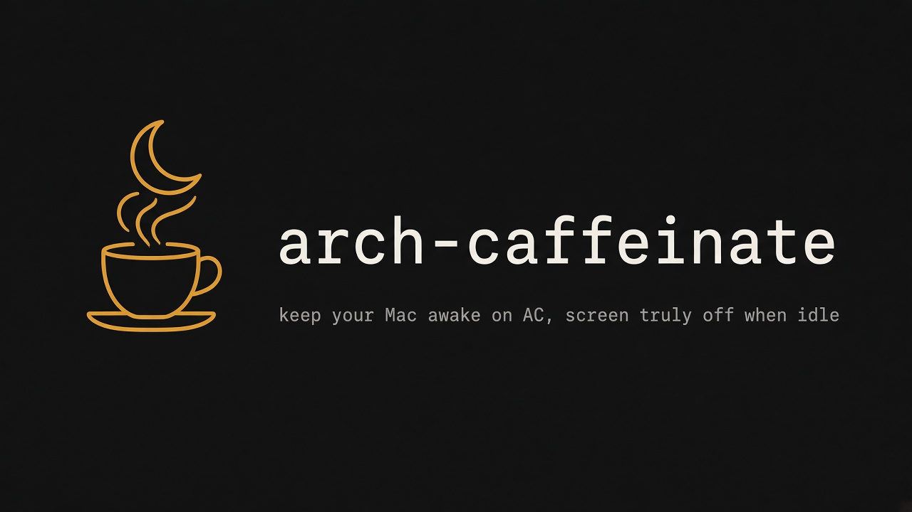

# arch-caffeinate



arch-caffeinate keeps a Mac awake while it is plugged in, and turns the display fully off after a stretch of idle time so the screen does not burn in.

It is for a Mac that sits plugged in for long stretches, for example as a home server or an always-on agent box. You want the machine awake and reachable, but you do not want a lit panel on the desk.

A LaunchAgent runs the daemon, `arch-caffeinate run`. Each poll the daemon reads the power source and the HID idle time, and writes a state file that `status` reads.

macOS ships `caffeinate`. arch-caffeinate differs in three ways.

- It holds the sleep assertion only while the Mac draws AC power. On battery it releases the assertion and lets the Mac sleep.
- When the idle time passes a threshold, it turns the display fully off, the same effect as `pmset displaysleepnow`. It does not leave the display in the macOS dim state.
- Mouse movement, a keypress, or a delivered notification turns the display back on.

The display wakes without a password prompt only when the macOS screen-lock setting is off. `status` and `doctor` report that setting. They do not change it.

Released as v1, open source under the [MIT License](LICENSE).

## Install

Build from a clone. `install` copies the binary to `~/.local/bin/arch-caffeinate` and writes the LaunchAgent plist. It does not load the agent, and it prints one line that says how to load it.

```bash
go build ./cmd/arch-caffeinate && ./arch-caffeinate install
```

A login bash that puts `~/.local/bin` on `PATH` can then run `arch-caffeinate`.

## Usage

```bash
arch-caffeinate startup install
arch-caffeinate status
arch-caffeinate startup remove
arch-caffeinate uninstall
```

- `startup install` loads the LaunchAgent, so the daemon starts now and at login.
- `status` prints the daemon state. Add `--json` for the fields listed in the contract.
- `startup remove` unloads the agent. The plist and the binary stay on disk.
- `uninstall` unloads the agent when it is loaded and removes the plist. Remove `~/.local/bin/arch-caffeinate` yourself if you no longer want it on `PATH`.

`install --startup` runs the install and the load in one step. `install --idle-seconds N` sets the idle threshold, 600 seconds by default. The load and unload commands are idempotent, and nothing prompts interactively.

## Docs

- [docs/cli-contract.md](docs/cli-contract.md) lists every command, flag, status field, and file the tool writes.
- [docs/design.md](docs/design.md) explains how the daemon decides to hold sleep, turn the display off, and wake it.
- [CONTRIBUTING.md](CONTRIBUTING.md) covers the tests and the repo rules. This repo is also a workspace for Cursor cloud agents, see [AGENTS.md](AGENTS.md).

## License

[MIT](LICENSE)
